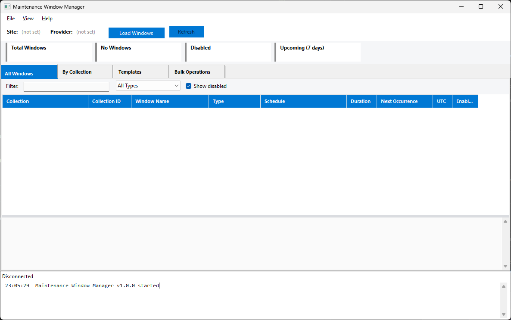

# Maintenance Window Manager

PowerShell WinForms GUI for viewing, creating, editing, and bulk-managing MECM maintenance windows across all device collections.

## What It Does

The MECM console buries maintenance windows deep in individual collection properties. This tool provides a single-pane view of every maintenance window in the environment, with CRUD operations, templates, and bulk management.



## Features

- **All Windows view** -- flat audit of every maintenance window across all collections with search, filter by type, and summary cards
- **By Collection view** -- browse collections, see which ones lack maintenance windows, create/edit/delete windows per collection
- **Templates** -- save and reuse common window patterns (Patch Tuesday offsets, weekly, daily, monthly); apply to multiple collections at once
- **Bulk Operations** -- import from CSV, copy windows between collections, bulk enable/disable, bulk delete with dry-run preview
- **Schedule Builder** -- visual dialog for defining recurrence patterns with duration, type, and UTC options
- **Export** -- CSV and HTML reports of all maintenance windows

## Prerequisites

| Requirement | Details |
|---|---|
| **OS** | Windows 10/11 or Windows Server 2016+ |
| **PowerShell** | 5.1 (ships with Windows) |
| **.NET Framework** | 4.8+ (required by WinForms GUI) |
| **ConfigMgr Console** | Installed locally -- provides `ConfigurationManager.psd1` |
| **MECM Permissions** | RBAC rights to read/modify collections and maintenance windows |

## Usage

1. Open PowerShell and navigate to the project directory.

2. Launch the GUI:
   ```powershell
   .\start-maintenancewindowmgr.ps1
   ```

3. Set your Site Code and SMS Provider in **File > Preferences**.

4. Click **Load Windows** to connect and retrieve all maintenance windows.

## Templates

Five default templates are included in the `Templates/` folder:

| Template | Type | Schedule |
|---|---|---|
| Patch Tuesday + 3 Days | Software Updates | Monthly, 3 days after second Tuesday, 2:00 AM, 4 hours |
| Patch Tuesday + 7 Days | Software Updates | Monthly, 7 days after second Tuesday, 2:00 AM, 4 hours |
| Weekly Sunday 2 AM | General | Every Sunday, 2:00 AM, 4 hours |
| Daily After Hours | General | Daily, 11:00 PM, 6 hours |
| Monthly First Saturday | General | First Saturday, 1:00 AM, 6 hours |

Create custom templates via the Templates tab or save existing windows as templates from the right-click menu.

## CSV Import Format

For bulk import, use a CSV with these columns:

```
CollectionID,WindowName,RecurrenceType,StartHour,StartMinute,DurationHours,DurationMinutes,WindowType,DayOfWeek,IsUtc
ABC00123,Server Patching,Weekly,2,0,4,0,SoftwareUpdatesOnly,Sunday,false
```

## License

MIT
